* Table of Contents
{:toc}

--------------------------------------------------------------------------------------------------------------------

## **Design**

### Architecture

The ***Architecture Diagram*** given above explains the high-level design of the App. Given below is a quick overview of each component.

**`Main`** has two classes called [`Main`](https://github.com/AY2021S1-CS2103T-W16-3/tp/blob/master/src/main/java/ay2021s1_cs2103_w16_3/finesse/Main.java) and [`MainApp`](https://github.com/AY2021S1-CS2103T-W16-3/tp/blob/master/src/main/java/ay2021s1_cs2103_w16_3/finesse/MainApp.java). It is responsible for:
* on app launch - initializing the components in the correct sequence, and connecting them to each other.
* on shut down - shutting down the components and invoking cleanup methods where necessary.

[**`Commons`**](#common-classes) represents a collection of classes used by multiple other components.

The rest of the App consists of four components.

* [**`UI`**](#ui-component): The App's User Interface.
* [**`Logic`**](#logic-component): The command executor.
* [**`Model`**](#model-component): Holds the data of the App in memory.
* [**`Storage`**](#storage-component): Reads data from, and writes data to, the hard disk.

Each of the four components:

* defines its *API* in an `interface` with the same name as the Component.
* exposes its functionality using a concrete `{Component Name}Manager` class (which implements the corresponding API `interface` mentioned in the previous point.

For example, the `Logic` component (see the class diagram given below) defines its API in the `Logic.java` interface and exposes its functionality using the `LogicManager.java` class which implements the `Logic` interface.

**How the architecture components interact with each other**

The *Sequence Diagram* below shows how the components interact with each other for the scenario where the user issues the command `delete 1`.

The sections below give more details of each component.

### UI component

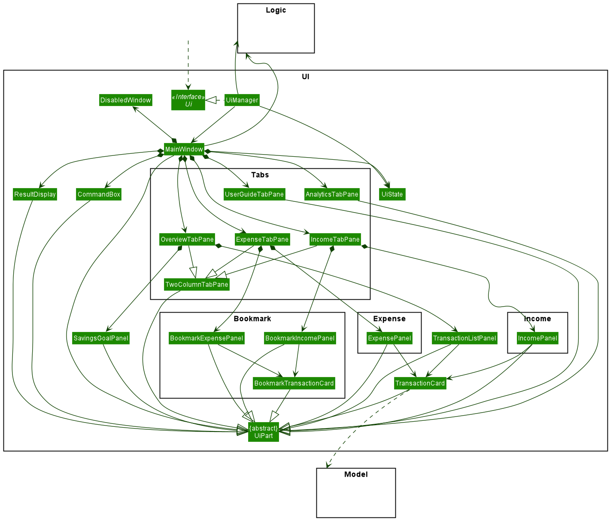

**API** :
[`Ui.java`](https://github.com/AY2021S1-CS2103T-W16-3/tp/blob/master/src/main/java/ay2021s1_cs2103_w16_3/finesse/ui/Ui.java)

The UI consists of a `MainWindow` that is made up of parts e.g.`CommandBox`, `ResultDisplay`, `TransactionListPanel`, `OverviewTabPane` etc.
All of these, including `MainWindow`, inherit from the abstract `UiPart` class.

There are 5 tab panes which are contained within `MainWindow`:
* `OverviewTabPane` - Displays an overview of the most recent transactions (both incomes and expenses) along with the savings goals.
  * Contains `TransactionListPanel` and `SavingsGoalPanel`.
* `IncomeTabPane` - Displays a list of incomes along with bookmark incomes.
  * Contains `IncomePanel` and `BookmarkIncomePanel`.
* `ExpenseTabPane` - Displays a list of expenses along with bookmark expenses.
  * Contains `ExpensePanel` and `BookmarkExpensePanel`.
* `AnalyticsTabPane` - Displays statistics.
* `UserGuideTabPane` - Displays the user guide.

The `UI` component uses the JavaFx UI framework. The layout of these UI parts is defined in matching `.fxml` files that are in the `src/main/resources/view` folder.
For example, the layout of [`MainWindow`](https://github.com/AY2021S1-CS2103T-W16-3/tp/blob/master/src/main/java/ay2021s1_cs2103_w16_3/finesse/ui/MainWindow.java) is specified in [`MainWindow.fxml`](https://github.com/AY2021S1-CS2103T-W16-3/tp/blob/master/src/main/resources/view/MainWindow.fxml).

The `UI` component:

* executes user commands using the `Logic` component.
* listens for changes to `Model` data so that the UI can be updated with the modified data.

### Logic component

**API** :
[`Logic.java`](https://github.com/AY2021S1-CS2103T-W16-3/tp/blob/master/src/main/java/ay2021s1_cs2103_w16_3/finesse/logic/Logic.java)

1. `Logic` uses the `FinanceTrackerParser` class to parse the user command.
1. This results in a `Command` object which is executed by `LogicManager`.
1. The command execution can affect `Model` (e.g. adding a transaction).
1. The result of the command execution is encapsulated as a `CommandResult` object which is passed back to `Ui`.
1. In addition, the `CommandResult` object can also instruct `Ui` to perform certain actions, such as displaying the help message to the user.

Below is the Sequence Diagram for interactions within the `Logic` component for the `execute("delete 1")` API call.

:information_source: **Note:** The lifeline for `DeleteCommandParser` should end at the destroy marker (X) but due to a limitation of PlantUML, the lifeline reaches the end of diagram.

### Model component

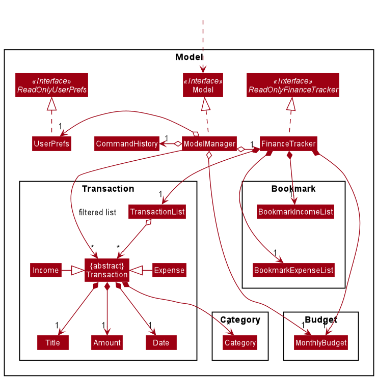

**API** : [`Model.java`](https://github.com/AY2021S1-CS2103T-W16-3/tp/blob/master/src/main/java/ay2021s1_cs2103_w16_3/finesse/model/Model.java)

The `Model`:

* stores a `UserPref` object that represents the user’s preferences.
* stores a `CommandHistory` object that keeps track of the 50 most recent commands entered.
* stores the finance tracker data in the following components:
    * a `TransactionList` containing `Transaction`s.
    * a `BookmarkExpenseList` and `BookmarkIncomeList`, each containing `BookmarkTransaction`s.
    * a `MonthlyBudget`.
* exposes `MonthlyBudget`, which can be 'observed' e.g. the UI can be bound to the values in the class so that the UI automatically updates when the values in the class changes.
* exposes an unmodifiable `ObservableList<Transaction>`, `ObservableList<Expense>`, `ObservableList<Income>`, `ObservableList<BookmarkExpense>` and `ObservableList<BookmarkIncome>` each, which can be 'observed' e.g. the UI can be bound to these lists so that the UI automatically updates when the data in the lists change.
* does not depend on any of the other three components (`UI`, `Logic`, `Storage`).

A `Transaction`:
* represents a unit of user data of transactions within the finance tracker.
* is either an `Expense` or an `Income`.
* is composed of a `Title`, an `Amount`, a `Date`, and any number of `Category`s. These are known as *data fields*.

A `BookmarkTransaction`:
* represents a unit of user data of bookmark transactions within the finance tracker.
* is either a `BookmarkExpense` or a `BookmarkIncome`.
* is composed of a `Title`, an `Amount`, and any number of `Category`s.

The *data fields* `Title`, `Amount`, `Date`, and `Category` are encapsulations of an underlying Java data type.

| Data Field  | Underlying Java Data Type   |
| ----------- | -------------------------   |
| `Title`     | `java.lang.String`          |
| `Amount`    | `java.math.BigDecimal`      |
| `Date`      | `java.time.LocalDate`       |
| `Category`  | `java.lang.String`          |

The underlying Java data types allow more operations to be done on `Transaction` objects, such as filtering `Transaction`s by `Date`, or aggregating the `Amount`s of `Expense`s and `Income`s.

:information_source: &nbsp;
**Note:** All data fields take in a `String` in their constructor, regardless of the underlying Java data type.
Within the constructor, data validation takes place to ensure that the `String` correctly represents a valid data field.
If the `String` given is not valid, an `IllegalArgumentException` will be thrown.
Otherwise, the `String` is parsed into the underlying Java data type.  
The reason for this is that when a data field object needs to be created, it is generally from a `String`
(such as when a user command parsed from the `Logic` component, or when a transaction is loaded from the `Storage` component).
This abstraction is maintained so that the implementation of other components (`Logic` and `Storage`) is independent of
the underlying Java data type choices in the `Model` component.

The `FinanceTracker` has the following fields:
* a `TransactionList` field which stores all `Expense` and `Income` objects together.
* a `BookmarkExpenseList` field which stores all `BookmarkExpense` objects.
* a `BookmarkIncomeList` field which stores all `BookmarkIncome` objects.
* a `MonthlyBudget` field which stores the user's set monthly expense limit and monthly savings goal, as well as all calculated values for the user's statistics.

The `ModelManager` has the following fields:
* three `FilteredList` fields which point to the same `ObservableList` obtained from `FinanceTracker::getTransactionList`. The `Predicate` fields in the three `FilteredList` fields are set such that:
    * `filteredTransactions` shows a view of all `Transaction` objects.
    * `filteredExpenses` shows a view of all `Transaction` objects of type `Expense`.
    * `filteredIncomes` shows a view of all `Transaction` objects of type `Income`.

    The motivation behind having three lists is due to the fact that there are three tabs in the user interface which display transactions, each having its own list while at the same time retrieving data from the same transaction list.
* two `ObservableList` fields, `castFilteredExpenses` and `castFilteredIncomes` that contain the same objects as that in `filteredExpenses` and `filteredIncomes` respectively. This is so that the UI can automatically update when the values in the two lists change.
* two `FilteredList` fields, `FilteredBookmarkExpenses` and `FilteredBookmarkIncomes` that point to the `ObservableList`s obtained from `FinanceTracker::getBookmarkExpenseList` and `FinanceTracker::getBookmarkIncomeList` respectively.
* a `MonthlyBudget` field which is the same as the `MonthlyBudget` stored in `FinanceTracker`.

### Storage component

**API** : [`Storage.java`](https://github.com/AY2021S1-CS2103T-W16-3/tp/blob/master/src/main/java/ay2021s1_cs2103_w16_3/finesse/storage/Storage.java)

The `Storage` component:

* can save `UserPref` objects in `JSON` format and read it back.
* can save the finance tracker data in `JSON` format and read it back.

`JsonAdaptedExpense` and `JsonAdaptedIncome` are `JSON`-friendly adaptations of `Expense` and `Income` respectively.
However, unlike `Expense` and `Income`, all the fields in `JsonAdaptedExpense` and `JsonAdaptedIncome` are `String` objects.
This is so that the fields are compatible with the `JSON` format.

`JsonSerializableFinanceTracker` contains two `List` fields, one containing all `JsonAdaptedExpense` objects and the other containing all `JsonAdaptedIncome` objects.
Despite the similarities between `Expense` and `Income`, and despite the fact that objects of both types are put into the same list in `FinanceTracker`,
the motivation behind keeping them separately is to ensure that they are separately listed in the `JSON` data file.

### Common classes

Classes used by multiple components are in the `ay2021s1_cs2103_w16_3.finesse.commons` package.

--------------------------------------------------------------------------------------------------------------------

## **Implementation**

This section describes some noteworthy details on how certain features are implemented.

### Tabs

#### Programmatically switch selected tab

##### Overview

Fine$$e supports the ability to switch tabs programmatically.
The following is a list of commands that utilise this ability:
* `help` - Opens the [user guide](UserGuide.md).
* `tab` - Switches to the tab corresponding to the index entered by the user.
* `add-expense` - Adds an expense to the finance tracker and switches to the Expenses tab.
* `ls-expense` - Shows a list of all expenses in the finance tracker by switching to the Expenses tab.
* `add-income` - Adds an income to the finance tracker and switches to the Incomes tab.
* `ls-income` - Shows a list of all incomes in the finance tracker by switching to the Incomes tab.
* `add-bookmark-expense` - Adds a bookmark expense to the finance tracker and switches to the Expenses tab.
* `add-bookmark-income` - Adds a bookmark income to the finance tracker and switches to the Incomes tab.

##### Implementation of feature

The ability to programmatically update the selected tab is implemented via `CommandResult`.
Upon the successful execution of a command, a `CommandResult` is generated and passed back to `MainWindow`.
This `CommandResult` contains the necessary information which the `MainWindow` needs to update the user interface, such as:
* The feedback to be displayed to the user;
* Whether to exit the application; and
* Whether to programmatically switch to a different tab in the user interface.

`MainWindow` will then select the tab specified in `CommandResult` as the active tab if applicable.

##### Switching tabs

The following sequence diagram shows how the `CommandResult` is created and returned upon the execution of any command.
If the command in question is one of those listed above, the UI will switch to the specified tab.

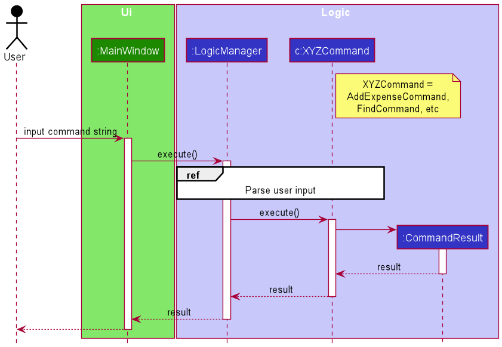

##### Design considerations

The alternative implementations considered, as well as the rationale behind our current implementation are as follows:

| Alternative considered  | Current implementation and rationale   |
| ----------- | -------------------------   |
| Add a method in `MainWindow` which can be called to programmatically switch tabs in the user interface upon execution of the command. | Encapsulate the tab switching information within `CommandResult` to prevent tight coupling of `Logic` and `UI` components. |

### Transactions

#### Add transactions feature

##### Overview
The add transactions feature allows users to add transactions into the `FinanceTracker`.
Each new transaction must have the data fields `Title`, `Amount`, `Date`, and `Category`.

Below is the class diagram of the components involved in the add transactions feature.

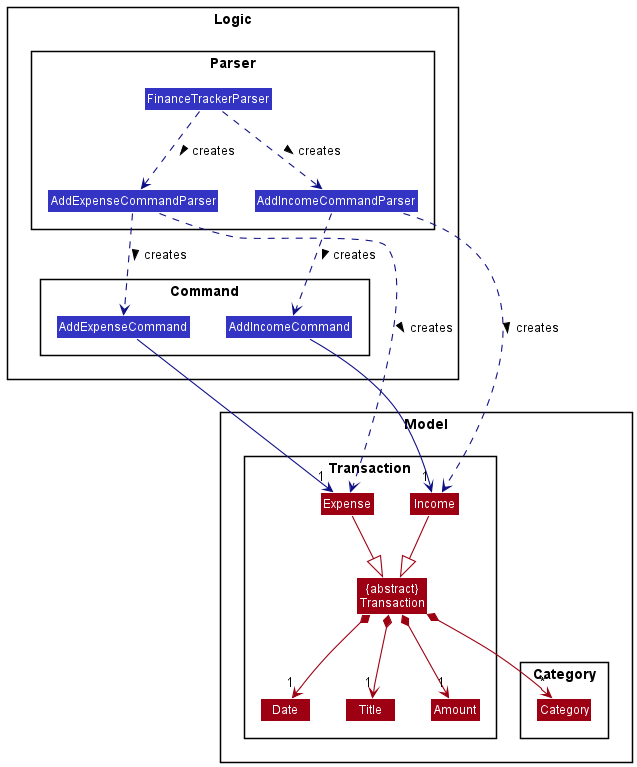

##### Implementation of feature

The add transactions feature is implemented via `AddExpenseCommand` and `AddIncomeCommand`, which are created from `AddExpenseCommandParser` and `AddIncomeCommandParser` respectively.

1. `AddExpenseCommandParser` and `AddIncomeCommandParser` take in the argument string and parses it into an `ArgumentMultimap` that contains all the different data fields mapped (as strings) to their respective prefix.
1. The strings are then parsed to create the data fields within the Model component (dependency arrows omitted in the above diagram for simplicity).
1. The parsers use the data fields to create `Expense` or `Income` objects, which are then used to create `AddExpenseCommand` or `AddIncomeCommand` objects.

`FinanceTrackerParser` decides whether `AddExpenseCommandParser` or `AddIncomeCommandParser` is used.
* On an `add-expense` or `adde` command, `AddExpenseCommandParser` is used.
* On an `add-income` or `addi` command, `AddIncomeCommandParser` is used.
* On an `add` command:
  * `AddExpenseCommandParser` is used if the user is currently on the Expenses tab.
  * `AddIncomeCommandParser` is used if the user is currently on the Incomes tab.
  * A `ParseException` is thrown if the user is currently on neither of the above tabs.

##### Adding transactions

Below is the sequence diagram for interactions within the `Logic` and `Model` components when the user inputs the `adde t/Bubble Tea a/5 d/03/10/2020 c/Food & Beverage` command while on the Expenses tab.
Note that the arguments in the full command string have been abbreviated to `...`.

When `AddIncomeCommandParser` is used, the sequence diagram is similar, but replace all occurrences of `Expense` with `Income`.

The following activity diagram summarizes what happens within `FinanceTrackerParser` when the user executes a new add command:

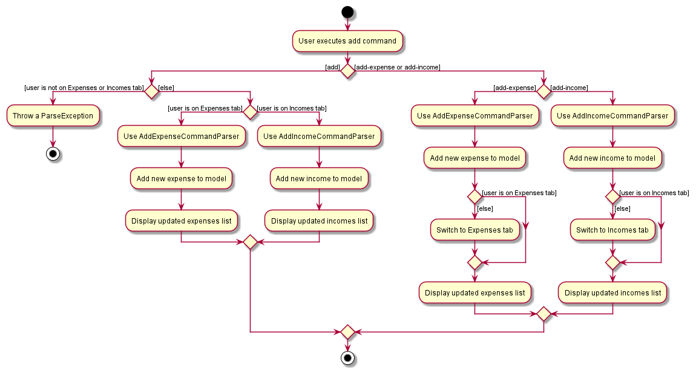

*Note: The diagram contains many repetitive processes. However, it cannot be simplified due to the limitations of PlantUML.*

##### Design considerations

The alternative implementations considered, as well as the rationale behind our current implementation are as follows:

| Alternative considered  | Current implementation and rationale   |
| ----------- | -------------------------   |
| Collapse both `AddExpenseCommandParser` and `AddIncomeCommandParser` into a single `AddTransactionCommandParser` whose result can then be used to create `AddExpenseCommand` or `AddIncomeCommand`. | Keep two separate parsers `AddExpenseCommandParser` and `AddIncomeCommandParser`. Although the `add` command can result in either `AddExpenseCommand` or `AddIncomeCommand`, `adde` will always create `AddExpenseCommand` while `addi` will always create `AddIncomeCommand`. It is more apt to use a specific parser in the latter cases. |
| Implement either `add` or `adde` + `addi` but not both. This reduces the amount of development work needed. | Both options are implemented to provide the user with a choice for whichever command they feel is most convenient. `add` can be used to add to the currently active tab, while `adde` and `addi` can be used on any tab. |

#### Edit transactions feature
##### Overview
The edit transactions feature allows users to edit existing transactions in the `FinanceTracker`.
At least one of the data fields `Title`, `Amount`, `Date`, and `Category` must be modified.

Below is the class diagram of the components involved in the edit transactions feature.

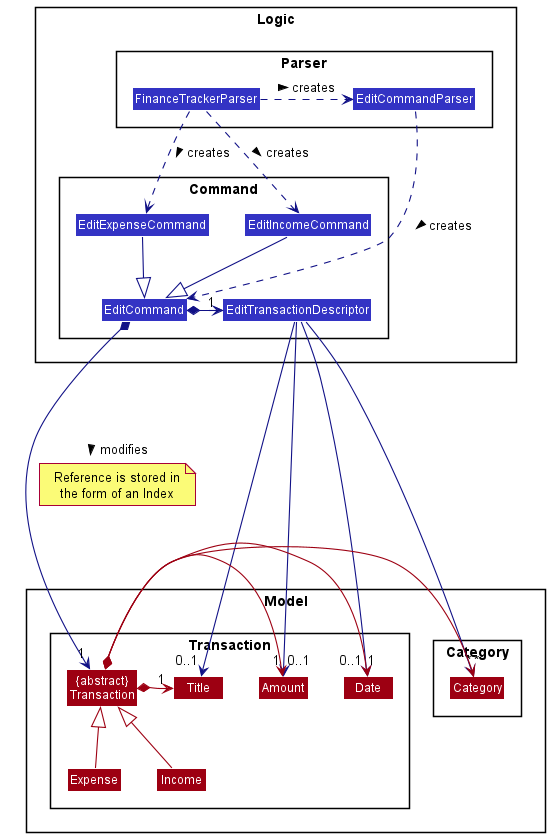

##### Implementation of feature

The edit transactions feature is implemented via `EditCommandParser`, which returns an `EditCommand` that is then used to create `EditExpenseCommand` or `EditIncomeCommand`.

1. `EditCommandParser` takes in the argument string and parses it into an `ArgumentMultimap` that contains all the different data fields mapped (as strings) to their respective prefix.
1. The index is parsed into an `Index`, which is used to locate the transaction to be modified during command execution.
1. The remaining strings are then parsed to create the data fields within the Model component (dependency arrows omitted in the above diagram for simplicity).
1. The data fields are used to create an `EditTransactionDescriptor` describing all of the new data fields.
1. The `Index` is combined with the `EditTransactionDescriptor` to return an `EditCommand`.

`FinanceTrackerParser` decides whether `EditExpenseCommand` or `EditIncomeCommand` is created from the resulting `EditCommand`.
* `EditExpenseCommand` is used if the user is currently on the Expenses tab.
* `EditIncomeCommand` is used if the user is currently on the Incomes tab.

##### Editing transactions

Below is the sequence diagram for interactions within the `Logic` and `Model` components when the user inputs the `edit 1 a/5` command while on the Expenses tab.
It is split into two diagrams, one for parsing and one for execution.

When `EditExpenseCommand` is used, the sequence diagram is similar, but replace all occurrences of `Expense` with `Income`.

The following activity diagram summarizes what happens within `FinanceTrackerParser` when the user executes a new edit command:

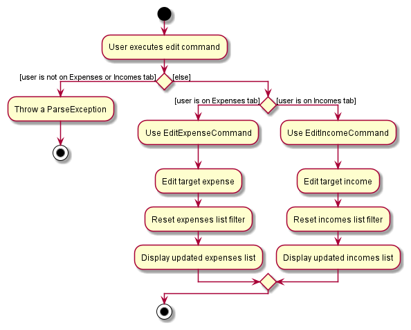

#### Delete transactions feature
##### Overview
The delete transactions feature allows users to remove transactions from the `FinanceTracker`.

Below is the class diagram of the components involved in the delete transactions feature.

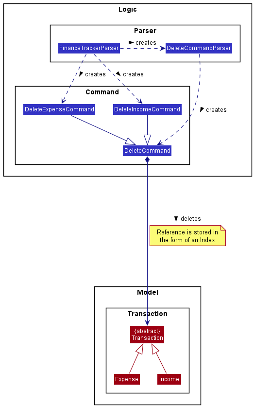

##### Implementation of feature

The edit transactions feature is implemented via `DeleteCommandParser`, which returns an `DeleteCommand` that is then used to create `DeleteExpenseCommand` or `DeleteIncomeCommand`.

1. `DeleteCommandParser` take in the argument string and parses the index into an `Index`, which is used to locate the transaction to be deleted during command execution.
1. The `Index` is used to return a `DeleteCommand`.

`FinanceTrackerParser` decides whether `DeleteExpenseCommand` or `DeleteIncomeCommand` is created from the resulting `DeleteCommand`.
* `DeleteExpenseCommand` is used if the user is currently on the Expenses tab.
* `DeleteIncomeCommand` is used if the user is currently on the Incomes tab.

##### Deleting transactions

Below is the sequence diagram for interactions within the `Logic` and `Model` components when the user inputs the `delete 1` command while on the Expenses tab.

When `DeleteExpenseCommand` is used, the sequence diagram is similar, but replace all occurrences of `Expense` with `Income`.

The following activity diagram summarizes what happens within `FinanceTrackerParser` when the user executes a new delete command:

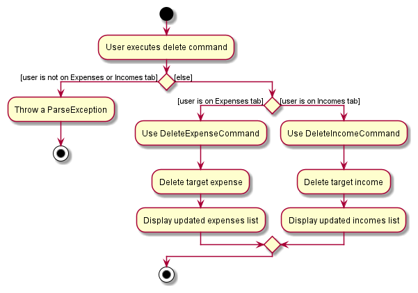

#### Find transactions feature
##### Overview

The find transactions feature allows users to search for transactions in the `FinanceTracker` by various search parameters.
Each search parameter corresponds to a different predicate which will be used to filter transactions in the various `FilteredList`s.

Below is the class diagram of the components involved in the find transactions feature.

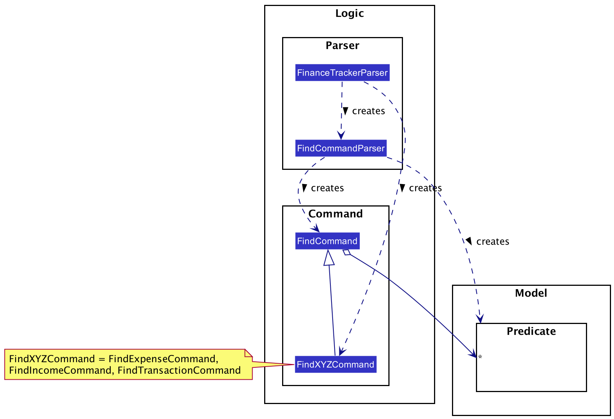

##### Implementation of feature

The find transactions feature is implemented via `FindCommandParser`, as well as the following commands:

* `FindCommand`, the base command that is returned when the command is parsed.
* `FindTransactionCommand`, to be executed when the user inputs the command on the Overview tab.
* `FindExpenseCommand`, to be executed when the user inputs the command on the Expenses tab.
* `FindIncomeCommand`, to be executed when the user inputs the command on the Incomes tab.

`FindCommandParser` takes in the argument string and parses it into an `ArgumentMultimap` that contains all the different search parameters mapped to their respective prefix.

Depending on the parameters present, `FindCommandParser` then creates a `List<Predicate<Transaction>>` containing the predicates that will be used to filter the transactions.
It then returns a `FindCommand` containing the list of predicates.

Depending on the UI tab the user inputted the command in, a `FindXYZCommand` (`FindTransactionCommand`, `FindExpenseCommand` or `FindIncomeCommand`) will be created from the base `FindCommand`.
When executed, the `FindXYZCommand` will combine all of the predicates in the list into a `combinedPredicate`, then sets the predicate of the respective `FilteredList` in `ModelManager` so that only the transactions matching the `combinedPredicate` will be displayed in the UI.

The list of predicates that can be used to filter the `FilteredList`s are as follows:
* `TitleContainsKeyphrasesPredicate` checks if any of the given keyphrases is present in the transaction's title.
* `HasExactAmountPredicate` checks if the transaction's amount is equal to the given amount.
* `OnExactDatePredicate` checks if the transaction's date is equal to the given date.
* `HasCategoriesPredicate` checks if the transaction's categories contains any of the given categories.
* `InAmountRangePredicate` checks if the transaction's amount is within the given amount range.
* `InDateRangePredicate` checks if the transaction's date is within the given date range.

##### Finding transactions

Below is the sequence diagram for interactions within the `Logic` and `Model` components when the user inputs the `"find t/tea a/5"` command while on the Overview tab.

The following activity diagram summarizes what happens when the user executes a new find command:

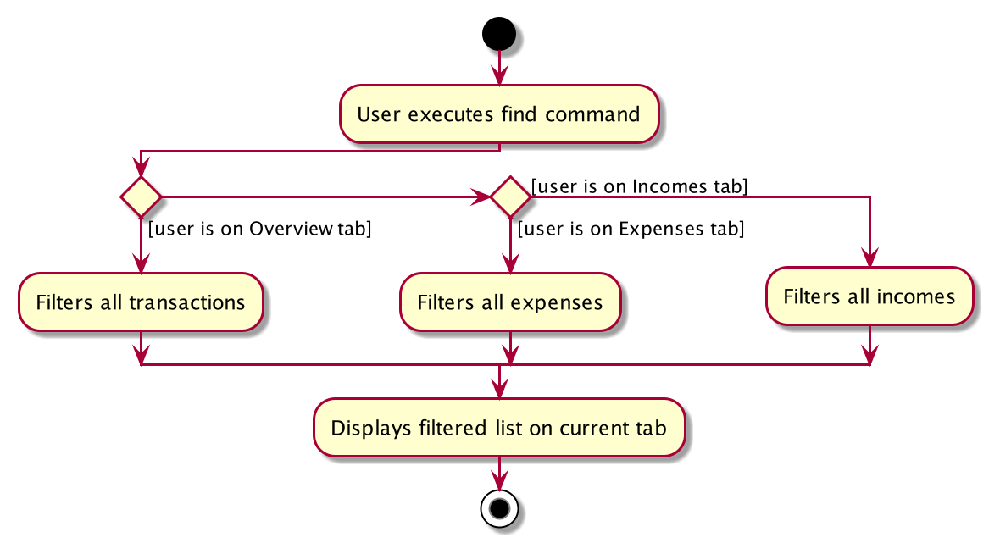

##### Design considerations

The alternative implementations considered, as well as the rationale behind our current implementation are as follows:

| Alternative considered  | Current implementation and rationale   |
| ----------- | -------------------------   |
| Having separate command parsers for each tab in which the find command can be input, e.g. `FindTransactionCommandParser`, `FindExpenseCommandParser` and `FindIncomeCommandParser`, which return a `FindTransactionCommand`, a `FindExpenseCommand` and a `FindIncomeCommand` respectively. | Use only one `FindCommandParser`, which returns a `FindCommand` that is then further split into the respective `FindXYZCommand`. This is because the parsing for the input is similar same regardless of the tab the user is on.          |
| Have `FindCommandParser` take in an `Index` corresponding to the parameter being searched. | Make the input of similar format to that of adding transactions, so that the input can be parsed into an `ArgumentMultimap` which is then used generate the relevant `Predicate`s. This is so that multiple search parameters can be employed in one command. |

### Budgeting
##### Overview

The budgeting feature allows users to track their remaining budget and current savings based on their set monthly expense limit and monthly savings goal.
The user sets the monthly expense limit and monthly savings goal, and the remaining budget and current savings will automatically be calculated based on the transactions in the `FinanceTracker`.

The class diagram below depicts the components involved in the budget feature.

##### Implementation of feature

The budgeting feature is implemented via `MonthlyBudget`, which contains the following fields:

* Two `ObjectProperty<Amount>` fields for `monthlyExpenseLimit` and `monthlySavingsGoal`.
* Two `ObjectProperty<CalculatedAmount>` fields for `remainingBudget` and `currentSavings`.
* Three `ObservableList<CalculatedAmount>` fields for `monthlyExpenses`, `monthlyIncomes` and `monthlySavings`, which are used for the [Analytics feature](#analytics).
* An `ObservableList<String>` of `months`, to determine which elements in the `ObservableList<CalculatedAmount>` corresponds to which month.

`CalculatedAmount` differs from `Amount` in that a `CalculatedAmount` can be negative, and supports addition and subtraction.

The method that is integral to the `MonthlyBudget` is the `calculateBudgetInfo` method.
It takes in the current `TransactionList` in the `FinanceTracker` and an integer `numOfMonths`, and recalculates all `CalculatedAmount`s in the `MonthlyBudget` as follows:
* Sum the amounts of all `Expense`s in the `TransactionList` dated in the current month, subtracts it from `monthlyExpenseLimit`, and sets it as the `remainingBudget`.
* Sums the amounts of all `Expense`s in the `TransactionList` dated in the current month, subtracts it from the sum of all `Income`s dated in the current month, and sets it as the `currentSavings`.
* For the past number of months indicated by `numOfMonths` (including the current month), calculate the total expenses, total incomes and total savings for each month and add them to the corresponding `ObservableList<CalculatedAmount>`.

The commands that trigger a call of `calculateBudgetInfo` are as follows:
* `AddExpenseCommand`, `AddIncomeCommand`, `DeleteExpenseCommand` and `DeleteIncomeCommand`, which change the total expenses/incomes of the `Transaction`s in the `TransactionList`.
* `EditExpenseCommand` and `EditIncomeCommand`, if the `Amount` is edited.
* `SetExpenseLimitCommand`, which changes the `Amount` in `monthlyExpenseLimit`.
* `SetSavingsGoalCommand`, which changes the `Amount` in `monthlySavingsGoal`.

`calculateBudgetInfo` is also called by `Storage` whenever the finance tracker data is loaded upon startup.

##### Set monthly spending limit

`SetExpenseLimitCommand` and `SetSavingsGoalCommand` work in similar ways.
Below is the sequence diagram for interactions within the `Logic` and `Model` components when the user inputs the `"setel a/500"` command.

The following activity diagram summarizes what happens when the user executes any command that changes the calculated values in `MonthlyBudget` (e.g. setting expense limit):

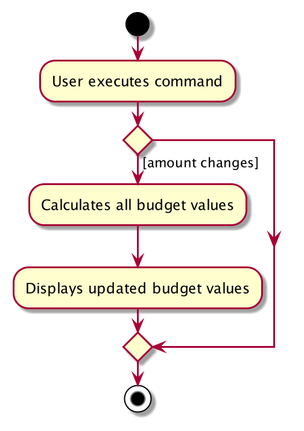

##### Design considerations

The alternative implementations considered, as well as the rationale behind our current implementation are as follows:

| Alternative considered  | Current implementation and rationale   |
| ----------- | -------------------------   |
| Use the `Amount` class for calculated amounts. | Use a separate class `CalculatedAmount` for calculated amounts, so as to avoid breaking abstraction and support negative values.

### Bookmark transaction
##### Overview

Bookmark transaction is a transaction that is a template that allows users to create transactions that they make frequently, such as paying phone bills monthly or receiving stipend for being a teaching assistant.
This feature reduces the hassle of keying in information repeatedly for identical transactions that occur frequently.

Bookmark Transaction object is made up of 3 fields. They are mainly: `Title`, `Amount` and `Category`.
The class diagram below depicts the structure of the `BookmarkTransaction`, `BookmarkExpense`, `BookmarkIncome`, `BookmarkExpenseList` and `BookmarkIncomeList` in the Model Component.

The class diagram below depicts the components involved in the budget feature.

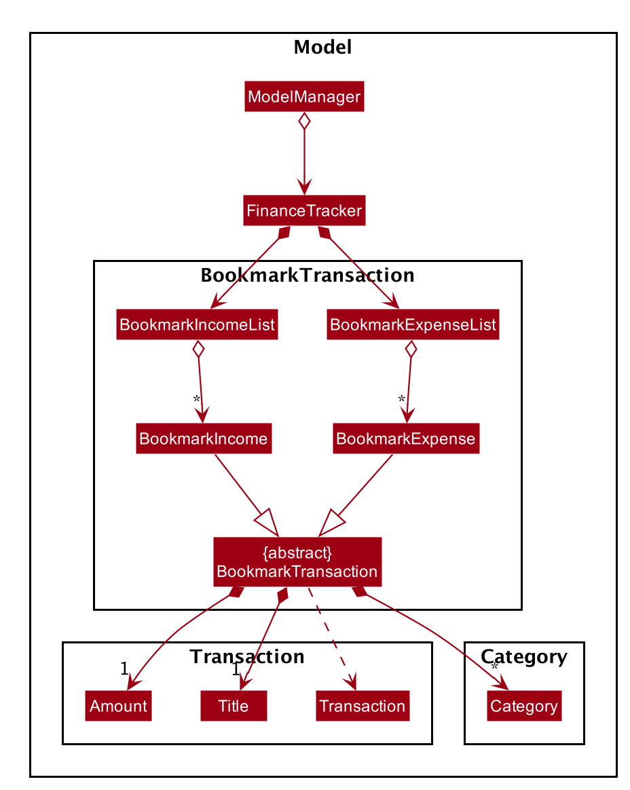

{:.image-caption}
Class diagram for bookmark transaction model component

##### Add bookmark expense

The add bookmark income feature allows users to add bookmark incomes into the `FinanceTracker`.

The following is a detailed elaboration of how `AddBookmarkExpenseCommand` operates.

**Step 1**. After the successful parsing of user input, the `AddBookmarkExpenseCommand#execute(Model model)` method is executed.

**Step 2**. `ModelManager#addBookmarkExpense(toAdd)` is invoked to add the new bookmark expense.

**Step 3**. The new bookmark expense is added into `FinanceTracker#bookmarkExpenses`,  via the `FinanceTracker#addBookmarkExpense(BookmarkExpense bookmarkExpense)`.

**Step 4**. This will then call the `BookmarkExpenseList#add(BookmarkExpense toAdd)` method which will check if the title of the new bookmark expense already exists in `BookmarkExpenseList#internalBookmarkExpenseList` via `BookmarkExpenseList#contains(BookmarkExpense toCheck)` before adding it.
If the title does exist already, the `DuplicateBookmarkTransactionException` will be thrown otherwise the new bookmark expense will be added.

**Step 5**. After successfully adding the new bookmark expense, the command box will be reflected with `AddBookmarkExpenseCommand#MESSAGE_SUCCESS` constant and a new `CommandResult` will be returned with the message.

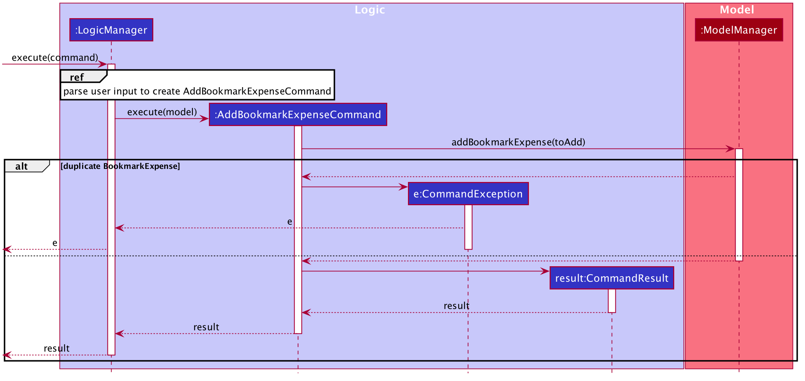

{:.image-caption}
Sequence diagram for adding bookmark expenses

{:.image-caption}
Reference frame for sequence diagram

##### Add bookmark income

The add bookmark income feature allows users to add bookmark incomes into the `FinanceTracker`.

The following is a detailed elaboration of how `AddBookmarkIncomeCommand` operates.

**Step 1**. After the successful parsing of user input, the `AddBookmarkIncomeCommand#execute(Model model)` method is executed.

**Step 2**. `ModelManager#addBookmarkIncome(toAdd)` is invoked to add the new bookmark income into Fine$$e.

**Step 3**. The new bookmark income is added into `FinanceTracker#bookmarkIncomes`,  via the `FinanceTracker#addBookmarkIncome(BookmarkIncome bookmarkIncome)`.

**Step 4**. This will then call the `BookmarkIncomeList#add(BookmarkIncome toAdd)` method which will check if the title of the new bookmark income already exists in `BookmarkIncomeList#internalBookmarkIncomeList` via `BookmarkIncomeList#contains(BookmarkIncome toCheck)` before adding it.
If the title does exist already, the `DuplicateBookmarkTransactionException` will be thrown otherwise the new bookmark income will be added.

**Step 5**. After successfully adding the new bookmark income, the command box will be reflected with `AddBookmarkIncomeCommand#MESSAGE_SUCCESS` constant and a new `CommandResult` will be returned with the message.

##### Edit bookmark transaction

The edit bookmark transaction feature allows users to edit the details of a specified bookmark transaction in the `FinanceTracker`. 

Below is the class diagram of the components involved in the edit bookmark transaction feature.

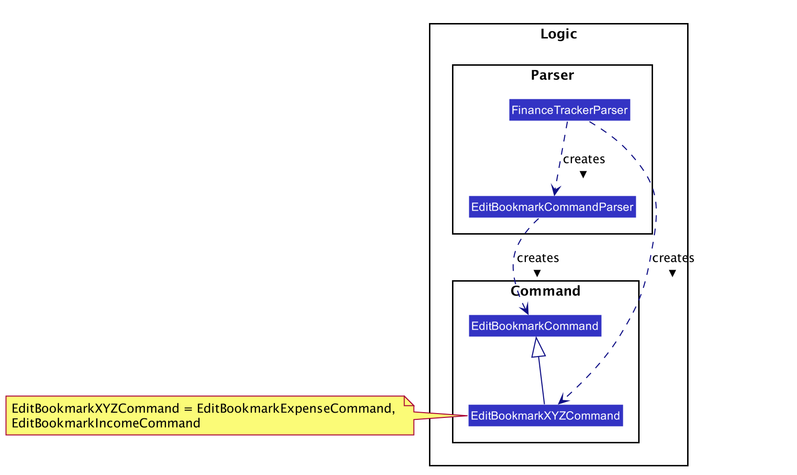

{:.image-caption}
Class diagram of components involved in edit bookmark transaction feature

> :information_source: &nbsp; `EditBookmarkExpenseCommand` and `EditBookmarkIncomeCommand` work in similar ways.

Following is a detailed elaboration of how `EditBoomarkExpenseCommand` operates.

> :information_source: &nbsp; This command can only be executed on the Expense Tab.

**Step 1**. After the successful parsing of user input, the `EditBookmarkExpenseCommand#execute(Model model)` method is called which checks if the `Index` defined as an argument when instantiating `EditBookmarkCommand(Index targetIndex, EditBookmarkTransactionDescriptor editBookmarkTransactionDescriptor)` is valid.
It uses `EditBookmarkTransactionDescriptor` to create a new edited bookmark expense.
Since it is optional for the users to input fields, the fields which are not entered will reuse the existing values that are currently stored and defined in the `BookmarkExpense` object.

> :information_source: &nbsp; The `Index` must be within the bounds of the list of bookmark expenses.

**Step 2**. A new `BookmarkExpense` with the newly updated attributes will be created which replaces the existing `BookmarkExpense` object using `Model#setBookmarkExpense(BookmarkExpense target, BookmarkExpense editedBookmarkExpense)` method.

**Step 3**. The filtered bookmark expense list is then updated with the new `BookmarkExpense` with the `Model#updateFilteredBookmarkExpenseList(PREDICATE_SHOW_ALL_BOOKMARK_EXPENSES)` method.

**Step 4**. The command box will be reflected with the `EditBookmarkExpenseCommand#MESSAGE_EDIT_BOOKMARK_EXPENSE_SUCCESS` constant and a new `CommandResult` will be returned with the success message.

##### Delete bookmark transaction

The delete bookmark transaction feature allows users to delete a specified bookmark transaction in the `FinanceTracker`.

Below is the class diagram of the components involved in the delete bookmark transaction feature.

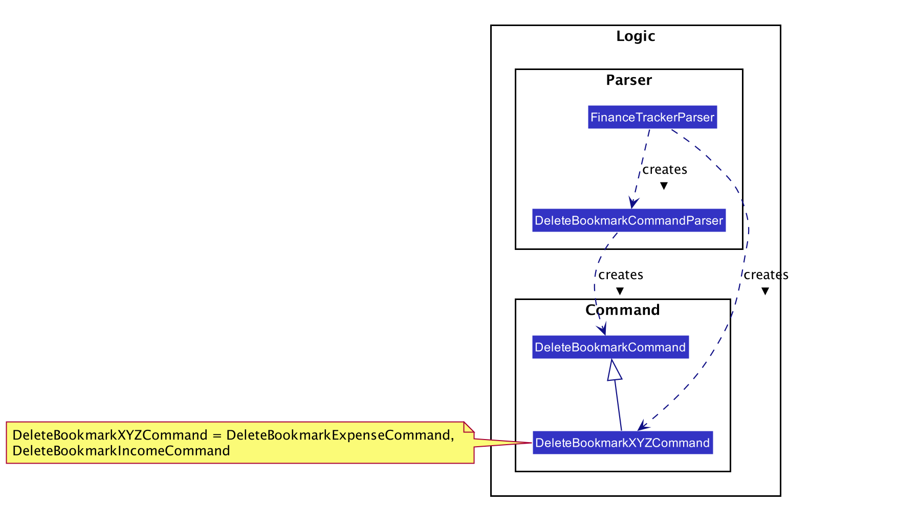

{:.image-caption}
Class diagram of components involved in delete bookmark transaction feature

> :information_source: &nbsp; `DeleteBookmarkExpenseCommand` and `DeleteBookmarkIncomeCommand` work in similar ways.

Following is a detailed elaboration of how `DeleteBoomarkExpenseCommand` operates.

> :information_source: &nbsp; This command can only be executed on the Expense Tab.

**Step 1**. After the successful parsing of user input, the `DeleteBookmarkExpenseCommand#execute(Model model)` method is called which checks if the `Index` defined when instantiating the `DeleteBookmarkCommand(Index index)` constructor is valid.

> :information_source: &nbsp; The `Index` must be within the bounds of the list of bookmark expenses.

**Step 2**. The `BookmarkExpense` at the specified `Index` is then removed from the `BookmarkExpenseList#internalBookmarkExpenseList` observable list using the `Model#deleteBookmarkExpense(BookmarkExpense bookmarkExpense)` method.

**Step 3**. The command box will be reflected with the `DeleteBookmarkExpenseCommand#MESSAGE_DELETE_BOOKMARK_EXPENSE_SUCCESS` constant and a new `CommandResult` will be returned with the success message.

The following activity diagram summarizes what happens when the user executes any command that deletes a specified bookmark expense:

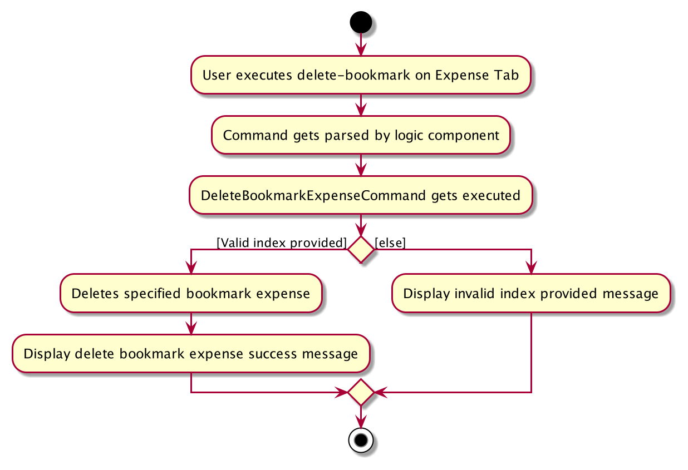

{:.image-caption}
Activity diagram for deleting bookmark expense

##### Convert bookmark transaction

The convert bookmark transaction feature converts a specified bookmark transaction into a transaction and adds it to the `FinanceTracker`.

Below is the class diagram of the components involved in the convert bookmark transaction feature.

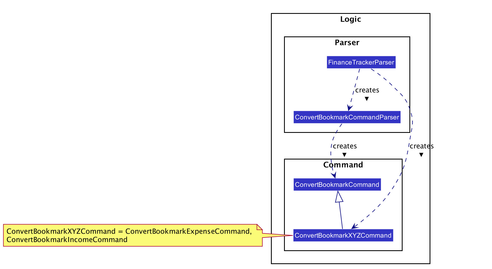

{:.image-caption}
Class diagram of components involved in convert bookmark transaction feature

> :information_source: &nbsp; `ConvertBookmarkExpenseCommand` and `ConvertBookmarkIncomeCommand` work in similar ways.

Following is a detailed elaboration of how `ConvertBoomarkExpenseCommand` operates.

> :information_source: &nbsp; This command can only be executed on the Expense Tab.

**Step 1**. After the successful parsing of user input, the `ConvertBookmarkExpenseCommand#execute(Model model)` method is called which checks if the `Index` defined when instantiating the `ConvertBookmarkCommand(Index index)` constructor is valid.

> :information_source: &nbsp; The `Index` must be within the bounds of the list of bookmark expenses.

**Step 2**. The list of bookmark expenses will then be retrieved by calling `Model#getFilteredBookmarkExpenseList()`. 

**Step 3**. The program will then retrieve the specified bookmark expense from the list of bookmark expenses. It will
then call `BookmarkExpense#convert` on the bookmark expense together with the date the user has inputted and convert
it to an `Expense` object.

**Step 4**. After converting the `BookmarkExpense` object to an `Expense` object, it will call `Model#addExpense` to add the
`Expense` object to the expense list in the finance tracker.

**Step 5**. The command box will be reflected with the `ConvertBookmarkExpenseCommand#MESSAGE_CONVERT_BOOKMARK_EXPENSE_SUCCESS` constant and a new `CommandResult` will be returned with the success message.

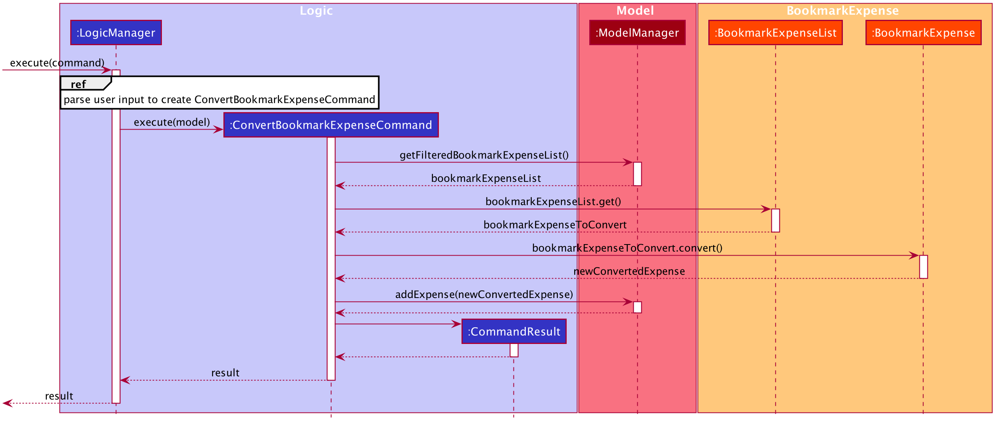

{:.image-caption}
Sequence diagram for converting bookmark expense to expense

### Analytics

##### Overview

The Analytics feature allows the user to view their spending and saving trends over a period of time.
Based on the current transaction lists, the total monthly expenses, incomes and savings over the past three months are calculated and displayed in the Analytics Tab in the form of bar charts.

##### Implementation of feature

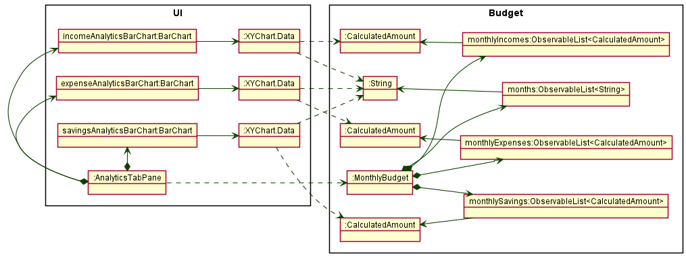

When the constructor for `AnalyticsTabPane` is called:
1. `AnalyticsTabPane` constructor takes in a `MonthlyBudget` object from `Model`.
1. The `BarChart` objects (`expenseAnalyticsBarChart`, `incomeAnalyticsBarChart` and `savingsAnalyticsBarChart`) are constructed and `Axis` objects are added to them.
1. The method `AnalyticsTabPane#populateData` is called and takes in the `MonthlyBudget` object.
   The following fields from `MonthlyBudget` are accessed:
   * `ObservableList<CalculatedAmount>` fields: `monthlyExpenses`, `monthlyIncomes` and `monthlySavings`
   * `ObservableList<String>` field: `months`

   The method `AnalyticsTabPane#populateDataIn` is called for each `BarChart` object.
1. In the method `AnalyticsTabPane#populateDataIn`, the values from the above fields in *step 3* are accessed to construct `XY.Data` objects.
1. The `XY.Data` objects are added to the `BarChart` objects.

##### Design considerations

* An external library, [Data2Viz](https://data2viz.io/), was considered, rather than *JavaFX Charts*, but the former was rejected due to difficulty in implementation.

### Command history

##### Overview

In order to fully replicate the Command Line Interface (CLI) experience, Fine$$e features the ability to navigate through the last 50 commands entered.
This is done by pressing the ↑ or ↓ arrow keys on the keyboard while focused on the command input box.

The class diagram below depicts the components involved in the command history feature.

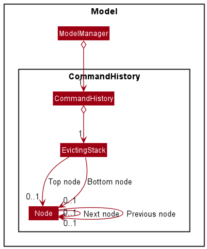

##### Implementation of feature

The command history feature is implemented via `CommandHistory`.
Whenever the user inputs a command, the command is added to the `CommandHistory` so as to be tracked.
Note that for this section on the command history, all mentions of 'command' refer to the user input, and not the various `Command`s present in the codebase.

`CommandHistory` is backed by an `EvictingStack`, a data structure that works similarly to a normal Last In First Out (LIFO) stack.
However, when the `EvictingStack` is full, the bottom-most element of the stack is removed (or in other words, evicted).
This behaviour is achieved by maintaining a doubly-linked list made out of `Node`s.

Each `Node` keeps track of the following information:
* Its value, which corresponds to a command in this context.
* A reference to the next `Node` in the linked list.
* A reference to the previous `Node` in the linked list.

For the `EvictingStack`, it keeps track of not only the `Node` at the top of the stack, but also the `Node` at the bottom.
This is so that the bottom-most element can be removed in Θ(1) time.
Due to the linked list being doubly-linked, we can then also find the next bottom-most element of the `EvictingStack` in constant time.

In addition, `CommandHistory` maintains an internal navigation state that gets reset whenever a new command is entered.
This internal navigation state keeps track of the current position while traversing the command history using the ↑ and ↓ arrow keys, much like a typical CLI.

##### Navigating the command history

When the ↑ arrow key is pressed, there are two possible scenarios:
1. The current command in the navigation state is the earliest tracked command.
  * Nothing happens.
1. The current command in the navigation state is not the earliest tracked command.
  * The command immediately preceding the current command is retrieved.

The following activity diagram summarizes what happens when the user presses the ↑ arrow key.

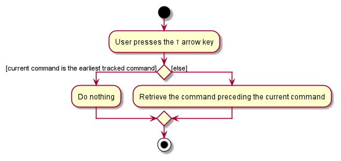

Similarly, when the ↓ arrow key is pressed, there are two possible scenarios:
1. The current command in the navigation state is the latest tracked command.
  * The command input box is cleared.
1. The current command in the navigation state is not the latest tracked command.
  * The command immediately succeeding the current command is retrieved.

The following activity diagram summarizes what happens when the user presses the ↓ arrow key.

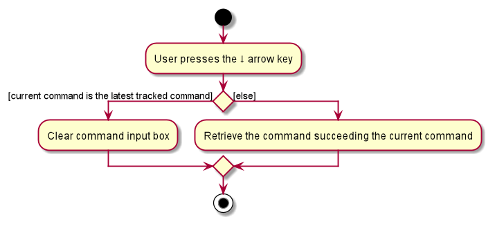

##### Design considerations

The alternative implementations considered, as well as the rationale behind our current implementation are as follows:

| Alternative considered  | Current implementation and rationale   |
| ----------- | -------------------------   |
| Use Java's in-built `Stack` class in `CommandHistory`. | Use a custom `EvictingStack` instead, so as to prevent potentially running out of memory if an extremely large number of commands are entered. |

### Data integrity safeguards

##### Overview

Since Fine$$e is an offline desktop application, it is reliant on the system time to perform date validations.
This makes it vulnerable to changes in the system time while it is running.
In particular, if the system time were to be changed to an earlier time, the existing data might get corrupted.

##### Implementation of feature

To safeguard against potential loss or corruption of data, Fine$$e tracks the system time across actions via `Timekeeper`, which keeps track of the last observed time.
Upon launching the application, `Timekeeper` is instantiated with the current system time.
Subsequently, every time a command is entered by the user, the last observed time in `Timekeeper` is validated against the current system time.

If the current system time is earlier than the last observed time, Fine\$\$e disables itself to prevent data loss.
A prompt is shown to the user to ensure that their system time is correct before restarting Fine$$e in order to continue using the application.
Upon relaunching the application, the data file is validated by `JsonFinanceTrackerParser`.

Should the current system time be later than or equals to the last observed time, the last observed time in `Timekeeper` is updated to the current system time.

##### Validating the time whenever a command is executed

The following sequence diagram shows what happens when a command is entered by the user.

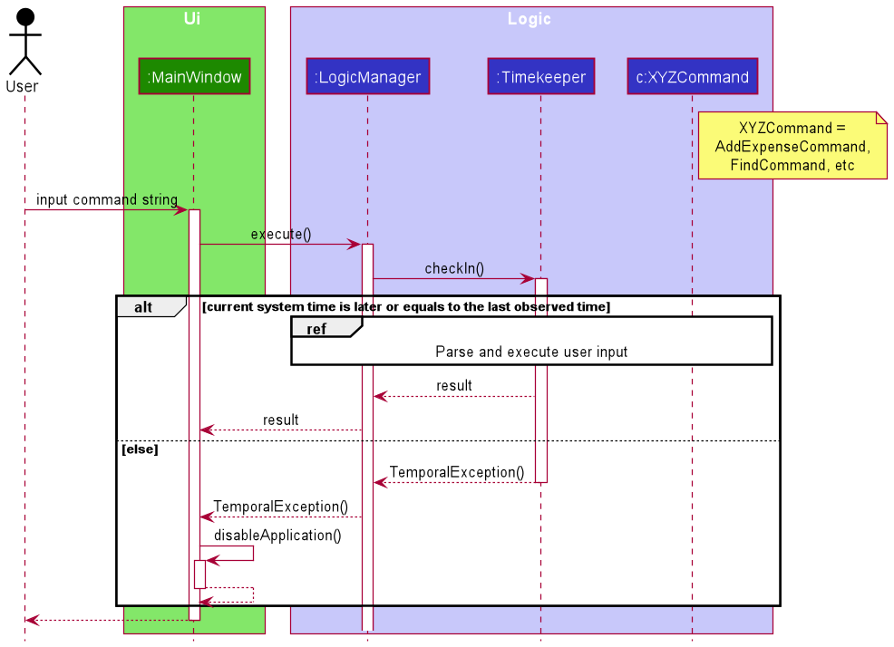

##### Design considerations

The alternative implementations considered, as well as the rationale behind our current implementation are as follows:

| Alternative considered  | Current implementation and rationale   |
| ----------- | -------------------------   |
| Query and use the time from some remote server rather than the system time. | Keep track of the last observed system time so that there is no need for an internet connection to use the application. |

--------------------------------------------------------------------------------------------------------------------

## **Appendix A: Product scope**

**Target user profile**:

* Tertiary student
* Has a need to track everyday expenses/incomes
* Wishes to cultivate good saving habits
* Prefers desktop apps
* Prefers typing to mouse interactions

**Value proposition**: Manage finances and cultivate good financial habits (such as saving) efficiently by typing in CLI commands

--------------------------------------------------------------------------------------------------------------------

## **Appendix B: User stories**

Priorities: High (must have) - `* * *`, Medium (nice to have) - `* *`, Low (unlikely to have) - `*`

| Priority | As a …​               | I want to …​                  | So that I can…​                                                          |
| -------- | ------------------------ | -------------------------------  | --------------------------------------------------------------------------- |
| `* * *`  | new user                 | see usage instructions           | refer to instructions when I forget how to use the app                      |
| `* * *`  | user                     | add an expense                   |                                                                             |
| `* * *`  | user                     | add an income                    |                                                                             |
| `* * *`  | user                     | view a list of past transactions | keep track of my past expenses/incomes                                      |
| `* * *`  | user                     | edit a transaction               | update expenses/incomes that were entered wrongly                           |
| `* * *`  | user                     | delete a transaction             | remove expenses/incomes that were entered wrongly                           |
| `* * *`  | user                     | group transactions by categories | keep track of my past expenses/incomes across various categories            |
| `* * *`  | user                     | search for transactions          | easily find related expenses/incomes                                        |
| `* * *`  | user                     | bookmark expenses                | easily add recurring expenses                                               |
| `* * *`  | user                     | bookmark incomes                 | easily add recurring incomes                                                |
| `* *`    | user                     | set a monthly spending limit     | plan the maximum amount I wish to spend for the month                       |
| `* *`    | user                     | set a monthly saving goal        | work towards saving consistently and reaching my savings goals              |
| `* *`    | user                     | see my remaining monthly budget  | track how much I have left to spend for the month                           |
| `* *`    | user                     | set a current monthly savings    | track how much I have to save to hit my savings goal                        |
| `* *`    | user                     | view my saving trends            | better plan my future expenses                                              |

--------------------------------------------------------------------------------------------------------------------

## **Appendix C: Use cases**

(For all use cases below, the **System** is `Fine$$e` and the **Actor** is the `user`, unless specified otherwise)

**Use case: Add an expense**

**MSS**

1.  User requests to add an expense
2.  Fine$$e adds the expense

    Use case ends.

**Extensions**

* 1a. The given data fields are invalid.

    * 1a1. Fine$$e shows an error message.

      Use case ends.

**Use case: Edit an expense**

**MSS**

1.  User requests to list expenses.
2.  Fine$$e shows a list of expenses.
3.  User requests to edit a specific expense.
4.  Fine$$e edits the expense.

    Use case ends.

**Extensions**

* 1a. User filters the list first.

    * 1a1. User filters the list using <u>Find an expense</u>.

      Use case resumes at step 3.

* 2a. The list is empty.

  Use case ends.

* 3a. The given index is invalid.

    * 3a1. Fine$$e shows an error message.

      Use case resumes at step 2.

* 3b. No data fields are specified.

    * 3b1. Fine$$e shows an error message.

      Use case resumes at step 2.

* 3c. The given data fields are invalid.

    * 3c1. Fine$$e shows an error message.

      Use case resumes at step 2.

**Use case: Add an income**

**MSS**

1.  User requests to add an income
2.  Fine$$e adds the income

    Use case ends.

**Extensions**

* 1a. The given data fields are invalid.

    * 1a1. Fine$$e shows an error message.

      Use case ends.

**Use case: Edit an income**

**MSS**

1.  User requests to list incomes.
2.  Fine$$e shows a list of incomes.
3.  User requests to edit a specific income.
4.  Fine$$e edits the income.

    Use case ends.

**Extensions**

* 1a. User filters the list first.

    * 1a1. User filters the list using <u>Find an income</u>.

      Use case resumes at step 3.

* 2a. The list is empty.

  Use case ends.

* 3a. The given index is invalid.

    * 3a1. Fine$$e shows an error message.

      Use case resumes at step 2.

* 3b. No data fields are specified.

    * 3b1. Fine$$e shows an error message.

      Use case resumes at step 2.

* 3c. The given data fields are invalid.

    * 3c1. Fine$$e shows an error message.

      Use case resumes at step 2.

**MSS**

1.  User requests to list expenses.
2.  Fine$$e shows a list of expenses.
3.  User requests to delete a specific expense.
4.  Fine$$e deletes the expense.

    Use case ends.

**Extensions**

* 2a. The list is empty.

  Use case ends.

* 3a. The given index is invalid.

    * 3a1. Fine$$e shows an error message.

      Use case resumes at step 2.

*{More to be added}*

**Use case: UC12 - Add Bookmark Expense**

**MSS**

1. User enters command, together with a title, expense amount and categories related to the bookmark expense.
2. Fine$$e displays the feedback that a new bookmark expense has been added.
3. Fine$$e bookmark expenses list panel will reflect the updated bookmark expenses list.

    Use case ends.
    
**Extensions**

* 1a. Command is invalid.

    * 1a1. Fine$$e shows an error message.
    
      Use case ends.
          
* 1b. Title of the new bookmark expense already exists in the bookmark expenses list.

    * 1b1. Fine$$e shows an error message.

      Use case ends.
          
**Use case: UC13 - Edit Bookmark Expense**

**MSS**

1. User enters command, together with an index of the bookmark expense to edit, and fields to update.
2. Fine$$e displays feedback that the specific bookmark expense chosen has been edited.
3. Fine$$e bookmark expenses list will display the updated bookmark expenses list.

    Use case ends.
    
**Extensions**

* 1a. Command is invalid.

    * 1a1. Fine$$e shows an error message.
    
      Use case ends.    
    
* 1b. Index given is invalid.

    * 1b1. Fine$$e shows an error message.

      Use case ends.
          
* 1c. Title of edited expense already exists in the bookmark expenses list.

    * 1c1. Fine$$e shows an error message.

      Use case ends.
      
**Use case: UC14 - Delete Bookmark Expense**

**MSS**

1. User enters command, together with index of the bookmark expense to delete.
2. Fine$$e displays the feedback that the specified bookmark expense is deleted.
3. Fine$$e’s bookmark expenses list will display the updated bookmark expenses list.

    Use case ends.
    
**Extensions**

* 1a. Command is invalid.

    * 1a1. Fine$$e shows an error message.
    
      Use case ends.

* 1b. Bookmark expenses list is empty.    
    
    * 1b1. Fine$$e shows an error message.
    
      Use case ends.
      
* 1c. Index given is invalid.

    * 1c1. Fine$$e shows an error message.
    
      Use case ends.
      
**Use case: UC15 - Convert Bookmark Expense**

**MSS**

1. User enters command, together with the index of the bookmark expense to convert and the date of when the user intends to convert the bookmark expense to an expense.
2. Fine$$e displays the feedback that the specified bookmark expense has been converted and added to the expenses list.
3. Fine$$e’s expense list will display the updated expenses list.

    Use case ends.
    
**Extensions**

* 1a. Command is invalid.

    * 1a1. Fine$$e shows an error message.
    
      Use case ends.

* 1b. Bookmark expenses list is empty.    
    
    * 1b1. Fine$$e shows an error message.
    
      Use case ends.
      
* 1c. Index given is invalid.

    * 1c1. Fine$$e shows an error message.
    
      Use case ends.
      
**Use case: UC16 - Add Bookmark Income**

**MSS**

1. User enters command, together with a title, income amount and categories related to the bookmark income.
2. Fine$$e displays the feedback that a new bookmark income has been added.
3. Fine$$e bookmark incomes list panel will reflect the updated bookmark incomes list.

    Use case ends.
    
**Extensions**

* 1a. Command is invalid.

    * 1a1. Fine$$e shows an error message.
    
      Use case ends.
          
* 1b. Title of the new bookmark income already exists in the bookmark incomes list.

    * 1b1. Fine$$e shows an error message.

      Use case ends.

**Use case: UC17 - Edit Bookmark Income**

**MSS**

1. User enters command, together with an index of the bookmark income to edit, and fields to update.
2. Fine$$e displays feedback that the specific bookmark income chosen has been edited.
3. Fine$$e bookmark incomes list will display the updated bookmark incomes list.

    Use case ends.
    
**Extensions**

* 1a. Command is invalid.

    * 1a1. Fine$$e shows an error message.
    
      Use case ends.    
    
* 1b. Index given is invalid.

    * 1b1. Fine$$e shows an error message.

      Use case ends.
          
* 1c. Title of edited income already exists in the bookmark incomes list.

    * 1c1. Fine$$e shows an error message.

      Use case ends.
      
**Use case: UC18 - Delete Bookmark Income**

**MSS**

1. User enters command, together with index of the bookmark income to delete.
2. Fine$$e displays the feedback that the specified bookmark income is deleted.
3. Fine$$e’s bookmark incomes list will display the updated bookmark incomes list.

    Use case ends.
    
**Extensions**

* 1a. Command is invalid.

    * 1a1. Fine$$e shows an error message.
    
      Use case ends.

* 1b. Bookmark incomes list is empty.    
    
    * 1b1. Fine$$e shows an error message.
    
      Use case ends.
      
* 1c. Index given is invalid.

    * 1c1. Fine$$e shows an error message.
    
      Use case ends.
      
**Use case: UC19 - Convert Bookmark Income**

**MSS**

1. User enters command, together with the index of the bookmark income to convert and the date of when the user intends to convert the bookmark income to an income.
2. Fine$$e displays the feedback that the specified bookmark income has been converted and added to the incomes list.
3. Fine$$e’s incomes list will display the updated incomes list.

    Use case ends.
    
**Extensions**

* 1a. Command is invalid.

    * 1a1. Fine$$e shows an error message.
    
      Use case ends.

* 1b. Bookmark incomes list is empty.    
    
    * 1b1. Fine$$e shows an error message.
    
      Use case ends.
      
* 1c. Index given is invalid.

    * 1c1. Fine$$e shows an error message.
    
      Use case ends.
    
--------------------------------------------------------------------------------------------------------------------

## **Appendix D: Non-Functional Requirements**

1.  Should work on any mainstream OS as long as it has Java `11` or above installed.
2.  Should be able to hold up to 1000 expenses/incomes without a noticeable sluggishness in performance for typical usage.
3.  A user with above average typing speed for regular English text (i.e. not code, not system admin commands) should be able to accomplish most of the tasks faster using commands than using the mouse.
4.  The data should be stored locally and should be in a human-editable text file.
5.  The data should not be stored in a Database Management System (DBMS).
6.  Should not require an installer.
7.  Should not depend on any remote server.

*{More to be added}*

--------------------------------------------------------------------------------------------------------------------

## **Appendix E: Glossary**

* **Expense**: A single transaction that results in a decrease in cash
* **Income**: A single transaction that results in an increase in cash
* **Mainstream OS**: Windows, Linux, Unix, OS-X
* **Savings**: Net gain (positive) or loss (negative) in cash over a set period of time
* **Data Fields**: The title, amount, date, and categories that make up an Expense or Income.

--------------------------------------------------------------------------------------------------------------------

## **Appendix F: Instructions for manual testing**

Given below are instructions to test the app manually.

:information_source: &nbsp; **Note:** These instructions only provide a starting point for testers to work on;
testers are expected to do more *exploratory* testing.

### Launch and shutdown

1. Initial launch

   1. Download the jar file and copy into an empty folder.

   1. Double-click the jar file. 
      Expected: Shows the GUI with a set of sample data. The window size may not be optimum.

1. Saving window preferences

   1. Resize the window to an optimum size. Move the window to a different location. Close the window.

   1. Re-launch the app by double-clicking the jar file. 
      Expected: The most recent window size and location is retained.

### Help and switching tabs

1. View help

    1. Test case: `help` 
       Expected: UI switches to the user guide.

    1. Test case: `help me` 
       Expected: There is no change to the UI. An error message is shown as the command cannot have any arguments.

1. Switching tabs

    1. Test case: `tab 2` 
       Expected: UI switches to the Expenses tab.

    1. Test case: `tab overview` 
       Expected: UI does not switch tabs. An error message is shown as the command format is invalid.

    1. Test case: `tab 5` 
       Expected: UI does not switch tabs. An error message is shown as the specified tab does not exist.

### Transactions

1. Adding an expense

    1. Test case: `add-expense t/Bubble Tea a/5 d/03/10/2020 c/Food & Beverage` 
    Expected: An expense titled `Bubble Tea` is added with the given details. UI switches to the Expenses tab.

    1. Test case: `add-expense t/Bubble Tea a/5 c/Food c/Beverage` 
    Expected: An expense titled `Bubble Tea` is added with the current date and two categories. UI switches to the Expenses tab.

    1. Test case: `add-expense t/Bubble Tea` 
    Expected: No expense is added. An error message is shown as the command format is invalid.

    1. Test case: `add-expense t/Bubble Tea a/5.000 d/03/10/2020 c/Food & Beverage` 
    Expected: No expense is added. An error message is shown as the parameter format is wrong.

    1. Test case: `add-expense t/ a/5.00 d/03/10/2020 c/Food & Beverage` 
    Expected: No expense is added. An error message is shown as the parameter is empty.

1. Adding an income

    1. Test case: `add-income t/Internship a/560 d/03/10/2020 c/Work` 
    Expected: An income titled `Internship` is added with the given details. UI switches to the Incomes tab.

    1. Test case: `add-income t/Internship a/560 c/Work c/Internship` 
    Expected: An expense titled `Internship` is added with the current date and two categories. UI switches to the Incomes tab.

    1. Test case: `add-income t/Internship` 
    Expected: No expense is added. An error message is shown as the command format is invalid.

    1. Test case: `add-income t/Internship a/560 d/03-10-2020 c/Work` 
    Expected: No expense is added. An error message is shown as the parameter format is wrong.

    1. Test case: `add-income t/Internship a/ d/03/10/2020 c/Work` 
    Expected: No expense is added. An error message is shown as the parameter is empty.

1. Editing a transaction

    1. Prerequisite: UI is on Expenses or Incomes tab. List displayed contains less than 5 transactions.

    1. Test case: `edit 1 t/Taxi a/10 d/31/10/2020 c/Transport` 
    Expected: First transaction in the list is edited with all details changed.

    1. Test case: `edit 1 c/` 
    Expected: First transaction in the list is edited with all categories cleared.

    1. Test case: `edit t/Taxi` 
    Expected: No transaction is edited. An error message is shown as the command format is invalid.

    1. Test case: `edit 5 a/10` 
    Expected: No transaction is edited. An error message is shown as the index provided is invalid.

    1. Test case: `edit 1 d/10/31/2020` 
    Expected: No transaction is edited. An error message is shown as the parameter format is wrong.

    1. Test case: `edit 1 d/` 
    Expected: No transaction is edited. An error message is shown as the parameter is empty.

    1. Test case: `edit 1` 
    Expected: No transaction is edited. An error message is shown as at least one parameter must be supplied.

1. Deleting a transaction

    1. Prerequisite: UI is on Expenses or Incomes tab. List displayed contains less than 5 transactions.

    1. Test case: `delete 1` 
    Expected: First transaction in the list is deleted.

    1. Test case: `delete first` 
    Expected: No transaction is deleted. An error message is shown as the command format is invalid.

    1. Test case: `delete 5` 
    Expected: No transaction is deleted. An error message is shown as the index provided is invalid.

1. Listing transactions

    1. Test case: `ls-expense` 
    Expected: UI switches to Expenses tab. All expenses are listed.

    1. Test case: `ls-income` 
    Expected: UI switches to Incomes tab. All incomes are listed.

    1. Test case: `ls-income all` 
    Expected: There is no change in the UI. An error message is shown as the command cannot have any arguments.

1. Finding transactions

    1. Prerequisite: UI is on Overview, Expenses or Incomes tab.

    1. Test case: `find t/Bubble Tea` 
    Expected: All transactions in the displayed list containing the keyphrase `Bubble Tea` (case-insensitive) are displayed.

    1. Test case: `find af/5 c/Food` 
    Expected: All transactions in the displayed list with the category `Food` and amount greater than or equal to `$5.00` are displayed.

    1. Test case: `find df/01/09/2020 dt/30/09/2020` 
    Expected: All transactions in the displayed list in September 2020 are displayed.

    1. Test case: `find tea` 
    Expected: There is no change in the UI. An error message is shown as the command format is wrong.

    1. Test case: `find d/` 
    Expected: There is no change in the UI. An error message is shown as the parameter is empty.

    1. Test case: `find af/10 at/5` 
    Expected: There is no change in the UI. An error message is shown as the range provided is invalid.

### Budgeting

1. Setting expense limit

    1. Test case: `set-expense-limit a/500` 
    Expected: UI switches to Overview tab. Monthly expense limit is changed to `$500.00`. Remaining monthly budget is recalculated.

    1. Test case: `set-expense-limit 500` 
    Expected: Monthly expense limit remains unchanged. An error message is shown as the command format is invalid.

    1. Test case: `set-expense-limit a/` 
    Expected: Monthly expense limit remains unchanged. An error message is shown as the parameter cannot be empty.

1. Setting savings goal

    1. Test case: `set-savings-goal a/500` 
    Expected: UI switches to Overview tab. Monthly savings goal is changed to `$500.00`.

    1. Test case: `set-savings-goal 500` 
    Expected: Monthly savings goal remains unchanged. An error message is shown as the command format is invalid.

    1. Test case: `set-savings-goal a/` 
    Expected: Monthly savings goal remains unchanged. An error message is shown as the parameter cannot be empty.

### Bookmark transactions

1. Adding a bookmark expense

    1. Test case: `add-bookmark-expense t/Phone Bill a/24 c/Utilities` 
    Expected: A bookmark expense titled `Phone Bill` is added with the given details. UI switches to the Expenses tab.

    1. Test case: `add-bookmark-expense t/Phone Bill` 
    Expected: No bookmark expense is added. An error message is shown as the command format is invalid.

    1. Test case: `add-bookmark-expense t/Phone Bill a/24.0 c/Utilities` 
    Expected: No bookmark expense is added. An error message is shown as the parameter format is wrong.

    1. Test case: `add-bookmark-expense t/ a/24 c/Utilities` 
    Expected: No bookmark expense is added. An error message is shown as the parameter is empty.

    1. Test case: `add-bookmark-expense t/Phone Bill a/24 d/10/10/2020 c/Utilities` 
    Expected: No bookmark expense is added. An error message is shown as bookmark expenses should not contain dates.

    1. Test case: `add-bookmark-expense t/Phone Bill a/24 c/Utilities` (again)  
    Expected: No bookmark expense is added. An error message is shown as duplicate bookmark expenses cannot be added.

1. Adding a bookmark income

    1. Test case: `add-bookmark-income t/Summer Internship a/1000 c/Work` 
    Expected: A bookmark income titled `Summer Internship` is added with the given details. UI switches to the Income tab.

    1. Test case: `add-bookmark-income a/1000 c/Work` 
    Expected: No bookmark income is added. An error message is shown as the command format is invalid.

    1. Test case: `add-bookmark-income t/Summer Internship a/1000.000 c/Work` 
    Expected: No bookmark income is added. An error message is shown as the parameter format is wrong.

    1. Test case: `add-bookmark-income t/Summer Internship a/ c/Work` 
    Expected: No bookmark income is added. An error message is shown as the parameter is empty.

    1. Test case: `add-bookmark-income t/Summer Internship a/1000 d/10/10/2020 c/Work` 
    Expected: No bookmark income is added. An error message is shown as bookmark incomes should not contain dates.

    1. Test case: `add-bookmark-income t/Summer Internship a/1000 c/Work` (again)  
    Expected: No bookmark income is added. An error message is shown as duplicate bookmark incomes cannot be added.

1. Editing a bookmark transaction

    1. Prerequisite: UI is on Expenses or Incomes tab. List displayed contains less than 5 bookmark transactions.

    1. Test case: `edit-bookmark 1 t/Taxi a/10 c/Transport` 
    Expected: First bookmark transaction in the list is edited with all details changed.

    1. Test case: `edit-bookmark 1 c/` 
    Expected: First bookmark transaction in the list is edited with all categories cleared.

    1. Test case: `edit-bookmark t/Taxi` 
    Expected: No bookmark transaction is edited. An error message is shown as the command format is invalid.

    1. Test case: `edit-bookmark 5 a/10` 
    Expected: No bookmark transaction is edited. An error message is shown as the index provided is invalid.

    1. Test case: `edit-bookmark 1 a/12.345` 
    Expected: No bookmark transaction is edited. An error message is shown as the parameter format is wrong.

    1. Test case: `edit-bookmark 1 d/` 
    Expected: No bookmark transaction is edited. An error message is shown as the parameter is empty.

    1. Test case: `edit 1` 
    Expected: No bookmark transaction is edited. An error message is shown as at least one parameter must be supplied.

1. Deleting a bookmark transaction

    1. Prerequisite: UI is on Expenses or Incomes tab. List displayed contains less than 5 bookmark transactions.

    1. Test case: `delete-bookmark 1` 
    Expected: First bookmark transaction in the list is deleted.

    1. Test case: `delete-bookmark first` 
    Expected: No bookmark transaction is deleted. An error message is shown as the command format is invalid.

    1. Test case: `delete-bookmark 5` 
    Expected: No bookmark transaction is deleted. An error message is shown as the index provided is invalid.

1. Converting a bookmark transaction

    1. Prerequisite: UI is on Expenses or Incomes tab. List displayed contains less than 5 bookmark transactions.

    1. Test case: `convert-bookmark 1 d/10/10/2020` 
    Expected: First bookmark transaction in the list is converted to a transaction with the given date.

    1. Test case: `convert-bookmark 1 c/` 
    Expected: First bookmark transaction in the list is converted to a transaction with the current date.

    1. Test case: `convert-bookmark d/10/10/2020` 
    Expected: No bookmark transaction is converted. An error message is shown as the command format is invalid.

    1. Test case: `convert-bookmark 5 d/10/10/2020` 
    Expected: No bookmark transaction is converted. An error message is shown as the index provided is invalid.

    1. Test case: `convert-bookmark 1 d/10/31/2020` 
    Expected: No bookmark transaction is converted. An error message is shown as the parameter format is wrong.

    1. Test case: `convert-bookmark 1 d/` 
    Expected: No bookmark transaction is converted. An error message is shown as the parameter is empty.

### Saving data

1. Dealing with missing data files

    1. Delete the file `fine$$e.json` in the `data` folder.

    1. Launch the app by double-clicking the jar file.
    Expected: Shows the GUI with a set of sample data.

1. Dealing with corrupted data files

    1. Replace the contents of `fine$$e.json` in the `data` folder with the text `File Corrupted`.

    1. Launch the app by double-clicking the jar file.
    Expected: Shows the GUI with no data.

1. Deleting data file while app is running

    1. Launch the app by double-clicking the jar file.

    1. While the app is running, delete the file `fine$$e.json` in the `data` folder.

    1. Close the app.
    Expected: `fine$$e.json` is regenerated with the data from the app.

